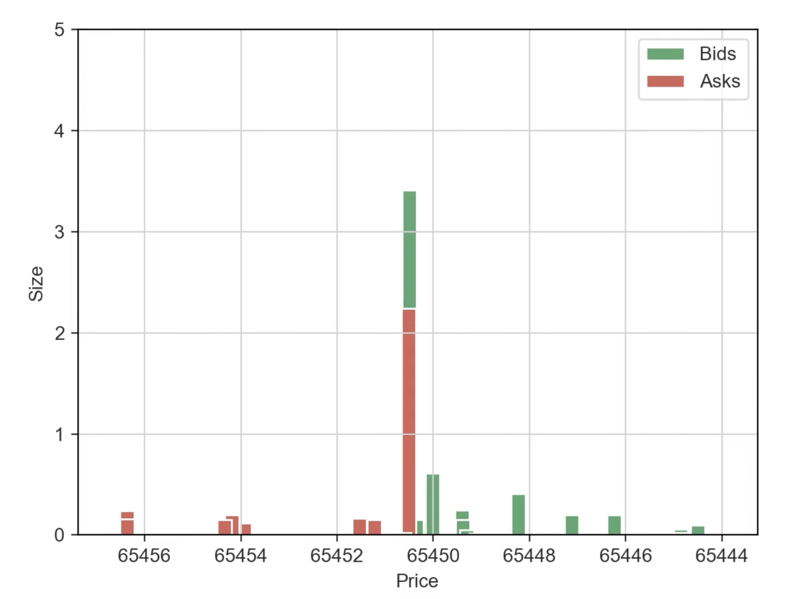

# Real-Time Order Book Visualization

This Python project provides a real-time visualization of the order book for the BTCUSDT trading pair on the Binance exchange using WebSocket technology. It allows traders to monitor live market dynamics and make informed trading decisions.

It's a part of Trading Framework project which you can get at https://quantjourney.substack.com/

## Features

- Real-time order book updates using Binance WebSocket API.
- Visualization of bids and asks as bar charts.
- Dynamic x-axis range adjustment to accommodate changing price levels.
- Display of the current spread between the best bid and ask prices.
- Consistent color scheme for bids and asks.
- Option to save the animation as a video file.

## Classes

- `Event`: Represents a market event with timestamp, sequence number, trade indicator, buy/sell indicator, price, and size.
- `Level`: Represents a price level in the order book with price and size.
- `OrderBook`: Represents the order book and maintains the current state of bids and asks. Provides methods to update the order book and retrieve relevant information.
- `WebSocketHandler`: Handles the WebSocket connection to the Binance server, subscribes to order book updates, and processes received messages.
- `RealTimePlotter`: Visualizes the order book using Matplotlib, updating the plot in real-time based on the data received from the WebSocket connection.

## Usage

1. Install the required dependencies: `matplotlib`, `websocket-client`, `seaborn`, `sortedcontainers`.
2. Run the `run_unit_test` function with the desired unit test, e.g., `run_unit_test(UnitTests.REALTIME_PLOT)`.
3. The real-time order book visualization will be displayed, and the animation will be saved as a video file.

This project serves as a mid-step towards integrating with the CCXT (CryptoCurrency eXchange Trading) library, enabling traders to access various cryptocurrency exchanges and perform advanced analysis and trading strategies.

**Demo Video**

For a full demonstration of the real-time order book visualization, watch the video below:

[Watch the Real-Time Order Book Visualization](orderbook.mp4)

## License

This project is open-source and available under the [MIT License](LICENSE).
